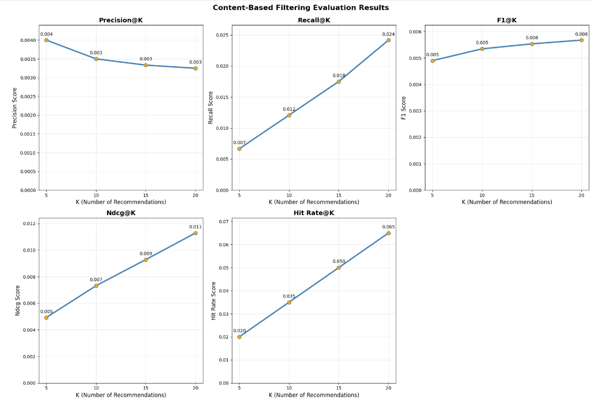
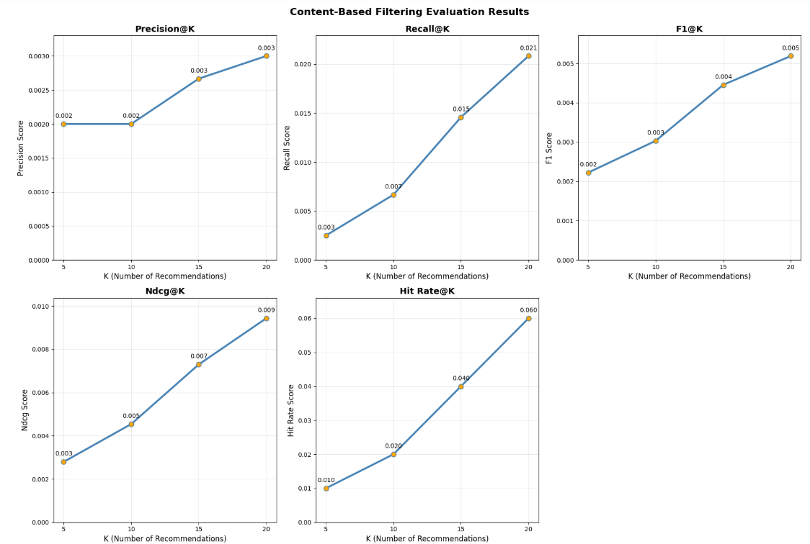
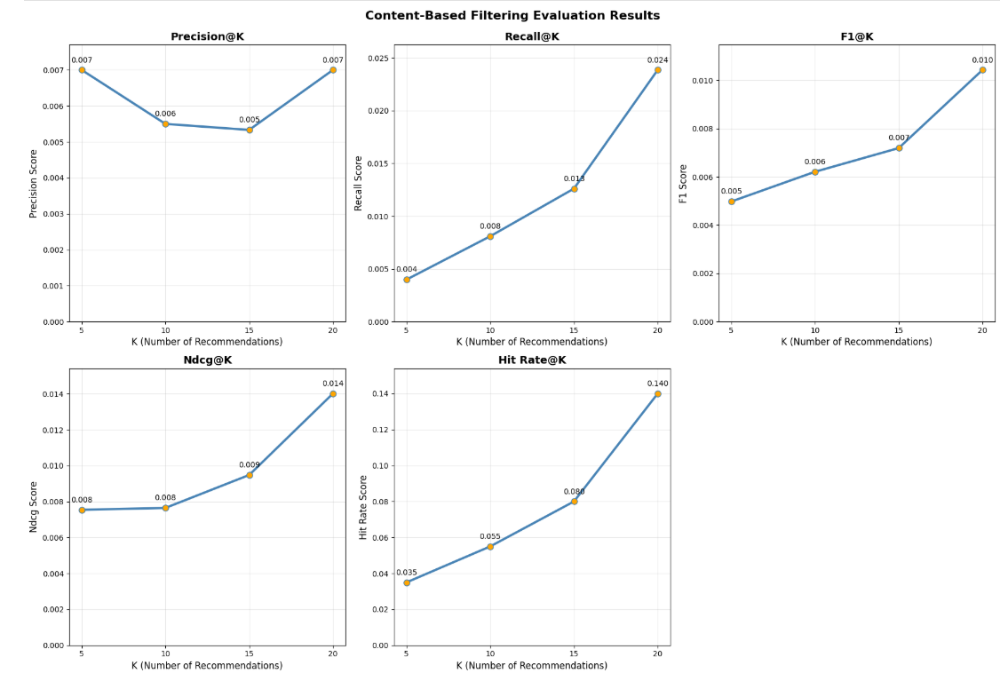
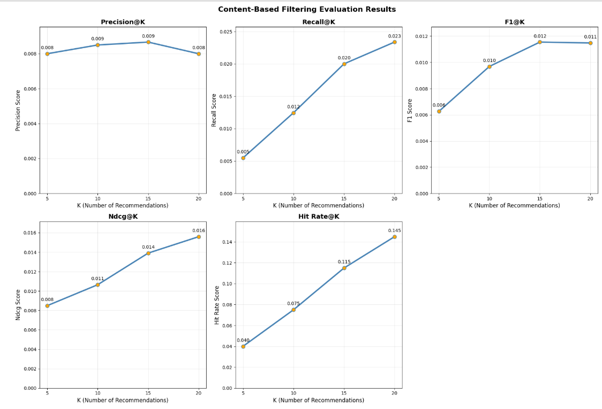

# Laporan Proyek Machine Learning - Suci Ihtisabi Hida Nursyifa

## Project Overview

Di era digital saat ini, pencarian properti hunian, baik untuk disewa maupun dibeli, semakin mengandalkan platform daring. Di tengah meningkatnya kebutuhan masyarakat urban terhadap hunian sewa yang sesuai preferensi, sistem pencarian properti konvensional belum mampu menyajikan hasil yang benar-benar relevan. Calon penyewa sering kali dihadapkan dengan jumlah listing yang sangat besar, yang membuat proses pencarian menjadi membingungkan dan memakan waktu.

Berdasarkan studi terbaru dari MeasuringU oleh Sauro, masih terdapat sejumlah masalah kritis dalam pengalaman pengguna pada situs-situs real estate yang ada. Salah satu masalah utama yang dihadapi pengguna adalah kesulitan dalam menyaring dan menemukan listing yang relevan dengan kebutuhan mereka. Banyak pengguna mengeluhkan bahwa fitur filter yang tersedia tidak cukup fleksibel, membingungkan, atau memerlukan terlalu banyak input manual, yang pada akhirnya membuat proses pencarian menjadi melelahkan dan tidak efisien [1].

Masalah-masalah ini penting untuk diselesaikan karena pengalaman pengguna yang buruk tidak hanya menghambat proses pencarian tetapi juga menurunkan kepercayaan dan loyalitas pengguna terhadap platform. Dalam konteks bisnis, ini berarti potensi kehilangan pengguna ke platform pesaing yang lebih responsif terhadap preferensi personal. Untuk itu, dibutuhkan solusi berupa sistem rekomendasi properti yang mampu menyajikan hasil pencarian yang relevan secara otomatis, menggantikan sebagian kebutuhan untuk filter manual, berdasarkan kemiripan konten,baik dari sisi deskripsi properti, harga, lokasi, maupun fitur lainnya.

**Referensi**:
[1] J. Sauro, J. Lewis, and E. Short, "UX and NPS Benchmarks of Real Estate Websites (2022)," MeasuringU, Jun. 14, 2022. [Online]. Available: https://measuringu.com/real-estate-benchmark-2022/. [Accessed: Jun. 14, 2025].

## Business Understanding

### Problem Statements

- Calon penyewa menghadapi kesulitan dalam menemukan properti yang sesuai preferensi karena keterbatasan dan kompleksitas fitur filter manual pada platform real estate, sehingga proses pencarian menjadi melelahkan dan tidak efisien.
- Diperlukan pendekatan yang efektif untuk mengukur kemiripan antar properti guna mendukung sistem rekomendasi yang relevan, akurat, dan dapat menggantikan sebagian fungsi pencarian manual.

### Goals

- Merancang sistem rekomendasi properti secara otomatis dan relevan, dengan memanfaatkan kemiripan konten properti, untuk meningkatkan efisiensi dan pengalaman pengguna.
- Mengimplementasikan dan membandingkan dua pendekatan pengukuran kemiripan (Cosine Similarity dan K-Nearest Neighbors dengan Euclidean Distance) untuk menentukan metode paling optimal dalam sistem rekomendasi properti.

### Solution statements

Untuk mencapai goals di atas, dua pendekatan solusi utama diajukan:

1. Content-Based Filtering dengan Cosine Similarity
Mengimplementasikan sistem rekomendasi content-based filtering yang menggunakan cosine similarity untuk mengukur kemiripan antar properti berdasarkan fitur-fitur konten. "Cosine Similarity mengukur kosinus dari sudut antara dua vektor" yang akan digunakan untuk menghitung tingkat kemiripan berdasarkan karakteristik properti

2. Content-Based Filtering dengan K-Nearest Neighbors (KNN) Euclidean Distance
Menerapkan pendekatan content-based filtering dengan algoritma K-Nearest Neighbors menggunakan Euclidean distance sebagai metrik untuk mengidentifikasi properti-properti yang paling mirip berdasarkan jarak dalam ruang fitur. 

Dalam konteks pencarian properti, content-based filtering dapat menganalisis berbagai aspek konten properti mulai dari deskripsi tekstual yang dapat diproses menggunakan teknik Natural Language Processing, hingga fitur numerik seperti harga, luas, dan jumlah fasilitas. Pendekatan ini memungkinkan sistem untuk memahami preferensi pengguna berdasarkan properti yang mereka minati, kemudian merekomendasikan properti lain dengan karakteristik serupa tanpa memerlukan data historis pengguna lain.

## Data Understanding
Dataset ini berisi informasi rinci tentang 1.000 properti sewa, termasuk karakteristik, lokasi, dan fitur deskriptif. Dataset ini cocok digunakan untuk sistem rekomendasi berbasis konten (content-based recommendation), di mana pengguna bisa direkomendasikan properti berdasarkan kesamaan fitur seperti ukuran, jarak ke stasiun, atau layout.


Unduh data: https://www.kaggle.com/datasets/sasakitetsuya/rental-recommender-data/data?select=rental_data.csv

### Variabel-variabel pada Dataset adalah sebagai berikut:
1) property_id (integer): Pengenal unik untuk setiap properti sewa.
2) property_name (string): Nama atau judul properti.
3) address (string): Lokasi properti, termasuk kota dan distrik.
4) rent (integer): Biaya sewa bulanan properti dalam Yen Jepang.
5) size_sqm (float): Luas lantai properti dalam meter persegi.
6) layout (string): Tata letak ruangan properti, seperti “1LDK” atau “3LDK”.
7) year_built (integer): Tahun ketika properti dibangun.
8) distance_to_station_km (float): Jarak dari stasiun kereta terdekat, diukur dalam kilometer.
9) description (string): Deskripsi tekstual singkat yang menyoroti fitur, fasilitas, atau lingkungan properti.

### Summary Informasi Data

Dataset ini memiliki:
- 1000 total baris data
- 9 kolom data

    | # | Column                    | Non-Null Count | Dtype   |
    | - | ------------------------- | -------------- | ------- |
    | 0 | property\_id              | 1000           | int64   |
    | 1 | property\_name            | 1000           | object  |
    | 2 | address                   | 1000           | object  |
    | 3 | rent                      | 1000           | int64   |
    | 4 | size\_sqm                 | 1000           | int64   |
    | 5 | layout                    | 1000           | object  |
    | 6 | year\_built               | 1000           | int64   |
    | 7 | distance\_to\_station\_km | 1000           | float64 |
    | 8 | description               | 1000           | object  |

- 0 total baris null
- 0 total baris duplikat
- 0 total baris outlier
- 8 kategori unik layout: '1K', '1DK', '1LDK', '2DK', '2K', '1R', '2LDK', '3LDK'
- 10 kategori unik alamat: 'Osaka, Namba', 'Fukuoka, Tenjin', 'Tokyo, Shinjuku', 'Yokohama, Minato Mirai', 'Kyoto, Gion', 'Kobe, Harborland''Hiroshima, Peace Park', 'Sapporo, Susukino', 'Sendai, Aoba', 'Nagoya, Sakae'
- statistik deskriptif kolom numerik ('rent', 'size_sqm', 'year_built', 'distance_to_station_km'):

| Variabel                     | Min    | 25%    | Median  | Mean    | 75%     | Max     | Std Dev |
| ---------------------------- | ------ | ------ | ------- | ------- | ------- | ------- | ------- |
| **`rent` (Yen)**             | 50,120 | 87,004 | 125,720 | 125,451 | 162,713 | 199,998 | 43,243  |
| **`size_sqm` (m²)**          | 15.0   | 36.0   | 58.0    | 57.21   | 78.0    | 100.0   | 24.52   |
| **`year_built`**             | 1980   | 1990   | 2001    | 2001    | 2012    | 2023    | 12.62   |
| **`distance_to_station_km`** | 0.1    | 0.8    | 1.55    | 1.55    | 2.3     | 3.0     | 0.86    |


### Exploratory Data Analysis
1. Visualisasi distribusi data dengan histogram terhadap kolom numerik serta menampilkan statistik skewness, kurtosis, dan standar deviasinya.
**Hasil insight:** *Skewness semua variabel numerik masih berada pada rentang -0.5 ~ 0.5, dimana berarti semua distribusi dalam rentang normal*
2. Visualisasi Rata-Rata Harga Sewa per Lokasi
**Hasil insight:** *Rata rata harga sewa di seluruh lokasi berada pad arange 120.000 ke atas. Rata-rata harga properti di Kyoto dan Saporo memiliki nilai rata-rata harga yang paling tinggi dibandingkan yang lainnya sedangkan Sendai memiliki nilai rata-rata harga properti yang lebih rendah dibandingkan lokasi lain.*
3. Visualisasi Rata-Rata Harga Sewa berdasarkan Tahun Dibangun
**Hasil insight:** *Tidak ada tren yang konsisten naik/turun antara tahun pembangunan dengan rata-rata harga sewa, tren nya cenderung fluktuatif yang menunjukkan bahwa usia bangunan bukan faktor utama yang menentukan harga sewa.*
4. Visualisasi Rata-Rata Harga Sewa per Layout
**Hasil insight:** *Layout 1LDK memiliki rata-rata harga sewa yang lebih tinggi sedangkan layout 2K dan 1R memiliki rata-rata harga sewa paling kecil*
5. Visualisasi Jarak ke Stasiun vs. Harga Sewa
**Hasil insight:** *Kota seperti Kobe, Kyoto, Hiroshima menunjukkan tren yang cukup jelas: semakin jauh dari stasiun, harga sewa menurun. Sementar aitu, lokasi lain korelasinya sangat lemah atau bahkan hampir datar*
6. Visualisasi Ukuran Properti vs. Harga Sewa
**Hasil insight:** *Kota seperti Yokohama, Fukuoka, Kyoto menunjukkan tren naik yang jelas, semakin besar ukuran properti, semakin mahal harga sewanya. Sementara lokasi lain, hubungan antara ukuran dan harga sewa tidak terlalu kuat atau bahkan cenderung negatif yang menunjukkan bahwa di beberapa kota, harga sewa tidak sepenuhnya proporsional terhadap ukuran*
7. Visualisasi Rata-Rata Ukuran Properti per Lokasi
**Hasil insight:** *Kyoto memiliki rata rata ukuran properti paling besar dibandingkan lokasi lain, dimana Fukuoka dan Sendai memiliki rata rata ukuran paling kecil diantara semua lokasi yaitu sebsar 50 meter persegi*
8. Visualisasi Distribusi Jumlah Properti per Lokasi
**Hasil insight:** *Kobe memiliki jumlah properti terbanyak dari semua kota hampir mendekati 120 jumlah properti sedangkan Sendai memiliki jumlah properti paling sedikit*

## Data Preparation
### Data Preprocessing
Menyiapkan data mentah agar bersih, terstruktur, dan siap digunakan oleh algoritma sistem rekomendasi. Tahapannya meliputi:

- Text Preprocessing untuk Kolom description. Membuat teks lebih seragam untuk diproses oleh model teks TF-IDF nantinya. Diantaranya dengan:
    - Mengubah semua huruf menjadi huruf kecil (lowercase)
    - Menghapus karakter khusus (seperti tanda baca, simbol)
    - Normalisasi spasi (menghapus spasi ganda)

- Normalisasi Fitur Numerik ('rent', 'size_sqm', 'year_built', 'distance_to_station_km'). Menstandarkan nilai fitur numerik ke rentang [0,1] untuk mencegah fitur dengan skala besar (seperti rent) mendominasi model.
- Encoding Kategorik (One-Hot Encoding). Mengubah fitur kategorikal (seperti layout dan address) menjadi representasi numerik.
- TF-IDF pada kolom description. Mengekstrak fitur tekstual dari kolom description_clean (kolom hasil output dari Text Preprocessing untuk Kolom description) dengan TF-IDF (Term Frequency-Inverse Document Frequency), yaitu menghitung pentingnya kata/kalimat dalam dokumen relatif terhadap semua dokumen.
*Setelah mendapatkan representasi TF-IDF dalam bentuk matriks, dilakukan reduksi dimensi menggunakan PCA (Principal Component Analysis) untuk merangkum informasi penting ke dalam 50 komponen utama. Hal ini membantu mengurangi kompleksitas fitur teks, mempercepat proses, dan mengurangi overfitting tanpa menghilangkan informasi penting.*
- Menggabungkan Semua Fitur. Membentuk satu matriks fitur gabungan yang berisi seluruh informasi penting: fitur numerik ('rent', 'size_sqm', 'year_built', 'distance_to_station_km') yang sudah di normalisasi, fitur kategorik (layout dan address) yang sudah di encoding, dan fitur teks (description) yang telah diekstrak dengan TF-IDF sebagai input akhir untuk proses rekomendasi.

### Preparation pre-modelling
Menyiapkan matriks dan struktur data yang akan digunakan untuk mencari item-item yang mirip berdasarkan fitur-fitur yang telah diproses.
- Cosine Similarity : Mengukur kesamaan arah (bukan jarak) antar vektor fitur
    ```
    similarity_matrix = cosine_similarity(feature_matrix)

    ``` 
- K-Nearest Neighbors (KNN) : Mencari K properti paling dekat (mirip) menggunakan jarak Euclidean
    ```
    knn_model = NearestNeighbors(metric='euclidean', n_neighbors=16)
    knn_model.fit(feature_matrix)
    distances, indices = knn_model.kneighbors(feature_matrix)

    ```

## Modeling
Tahapan ini membahas mengenai model sisten rekomendasi dengan dua pendekatan digunakan: Cosine Similarity dan K-Nearest Neighbors (KNN) berbasis Euclidean Distance. Model ini menghasilkan Top-10 Recommendations sebagai output.

1. Cosine Similarity

    **Cara Kerja:** Cosine similarity mengukur kesamaan antara dua vektor (properti) dengan menghitung cosinus dari sudut di antara mereka. Nilai kemiripan berkisar antara 0 (tidak mirip) hingga 1 (identik). Semakin tinggi nilainya, semakin mirip dua properti tersebut.

    **Parameter:**
    ```
        similarity_matrix: Matriks kesamaan cosine antar semua properti.

        top_n: Jumlah rekomendasi yang ingin ditampilkan.

        property_name: Nama properti acuan.
    ```

    **Kelebihan:**
    - Tidak terpengaruh oleh skala fitur (karena hanya memperhatikan arah vektor).
    - Sangat efektif untuk data yang telah dinormalisasi.
    - Cepat dalam pencarian properti serupa dalam skala besar.

2. KNN (Euclidean Distance)

    **Cara Kerja:** K-Nearest Neighbors mencari properti yang paling dekat (paling mirip) berdasarkan jarak Euclidean antara properti acuan dengan properti lainnya pada fitur numerik. Karena jarak yang kecil menunjukkan kemiripan yang tinggi, maka untuk menyelaraskan interpretasi dengan cosine similarity, jarak dikonversi menjadi skor kemiripan dengan rumus:
    ```
    similarity = 1 / (1 + distance)
    ```

    **Parameter:**
    ```
    distances: Matriks jarak Euclidean antar properti.

    indices: Indeks properti-properti terdekat berdasarkan jarak.

    top_n: Jumlah properti terdekat yang direkomendasikan.
    ```

    **Kelebihan:**
    - Sederhana, tidak memerlukan pelatihan (non-parametrik).
    - Mendukung skenario real-time karena prosesnya cepat.
    - Konversi jarak → similarity memungkinkan interpretasi yang konsisten dengan metode lain seperti cosine.

### Hasil Rekomendasi Awal
- Cosine Similarity

    | No | Property Name | Similarity Score | Address               | Rent    | Year Built | Distance to Station (km) | Layout |
    | -- | ------------- | ---------------- | --------------------- | ------- | ---------- | ------------------------ | ------ |
    | 1  | Property\_21  | 0.808            | Tokyo, Shinjuku       | 91,243  | 2012       | 2.9                      | 1DK    |
    | 2  | Property\_261 | 0.803            | Hiroshima, Peace Park | 91,255  | 2010       | 2.5                      | 1DK    |
    | 3  | Property\_57  | 0.776            | Fukuoka, Tenjin       | 69,027  | 2007       | 2.6                      | 2K     |
    | 4  | Property\_614 | 0.776            | Fukuoka, Tenjin       | 147,939 | 2009       | 1.4                      | 2K     |
    | 5  | Property\_16  | 0.774            | Nagoya, Sakae         | 127,484 | 1999       | 2.2                      | 1DK    |
    | 6  | Property\_735 | 0.767            | Fukuoka, Tenjin       | 192,232 | 2017       | 1.2                      | 1DK    |
    | 7  | Property\_488 | 0.766            | Fukuoka, Tenjin       | 113,756 | 2022       | 1.5                      | 2K     |
    | 8  | Property\_545 | 0.762            | Fukuoka, Tenjin       | 120,482 | 2007       | 2.0                      | 1DK    |
    | 9  | Property\_459 | 0.762            | Fukuoka, Tenjin       | 73,702  | 2008       | 2.8                      | 2DK    |
    | 10 | Property\_288 | 0.754            | Fukuoka, Tenjin       | 172,400 | 2009       | 2.3                      | 1DK    |

- KNN (distance di convert ke similarity)

    | No | Property Name | Similarity Score | Address               | Rent    | Year Built | Distance to Station (km) | Layout |
    | -- | ------------- | ---------------- | --------------------- | ------- | ---------- | ------------------------ | ------ |
    | 1  | Property\_21  | 0.409            | Tokyo, Shinjuku       | 91,243  | 2012       | 2.9                      | 1DK    |
    | 2  | Property\_261 | 0.407            | Hiroshima, Peace Park | 91,255  | 2010       | 2.5                      | 1DK    |
    | 3  | Property\_57  | 0.395            | Fukuoka, Tenjin       | 69,027  | 2007       | 2.6                      | 2K     |
    | 4  | Property\_16  | 0.394            | Nagoya, Sakae         | 127,484 | 1999       | 2.2                      | 1DK    |
    | 5  | Property\_614 | 0.392            | Fukuoka, Tenjin       | 147,939 | 2009       | 1.4                      | 2K     |
    | 6  | Property\_545 | 0.389            | Fukuoka, Tenjin       | 120,482 | 2007       | 2.0                      | 1DK    |
    | 7  | Property\_488 | 0.389            | Fukuoka, Tenjin       | 113,756 | 2022       | 1.5                      | 2K     |
    | 8  | Property\_459 | 0.388            | Fukuoka, Tenjin       | 73,702  | 2008       | 2.8                      | 2DK    |
    | 9  | Property\_288 | 0.382            | Fukuoka, Tenjin       | 172,400 | 2009       | 2.3                      | 1DK    |
    | 10 | Property\_735 | 0.381            | Fukuoka, Tenjin       | 192,232 | 2017       | 1.2                      | 1DK    |

## Evaluation
### Metrik Evaluasi
Dalam evaluasi sistem rekomendasi, digunakan dua kategori metrik:
1. Coverage & Diversity
    - Catalog Coverage: Persentase item dalam katalog yang muncul setidaknya sekali di hasil rekomendasi. Metrik ini mengukur sejauh mana sistem mengeksplorasi seluruh item yang tersedia. Nilai yang tinggi menunjukkan sistem tidak hanya merekomendasikan item yang itu-itu saja (tidak "bias").
    - Layout Diversity: Mengukur variasi layout unit dalam hasil rekomendasi. Nilai tinggi berarti sistem menyarankan properti dengan konfigurasi yang beragam.
    - Address Diversity: Mengukur seberapa beragam alamat (lokasi) properti dalam hasil rekomendasi. Ini penting untuk menghindari rekomendasi yang hanya fokus di area tertentu.

2. Top-K Recommendation Metrics

    Digunakan untuk menilai kualitas rekomendasi berdasarkan data interaksi pengguna sintetis:

- Precision@K: Proporsi item yang direkomendasikan di Top-K yang benar-benar relevan bagi pengguna. Metrik ini menilai akurasi rekomendasi.
- Recall@K: Proporsi item relevan yang berhasil ditangkap dari seluruh item relevan yang ada. Metrik ini menunjukkan kemampuan sistem untuk menemukan item relevan.
- F1-Score@K: Harmonik dari Precision dan Recall. Cocok untuk menyeimbangkan trade-off antara keduanya.
- NDCG@K (Normalized Discounted Cumulative Gain): Mengukur posisi item relevan dalam daftar rekomendasi. Semakin awal item relevan muncul, semakin tinggi nilai NDCG.
- Hit Rate@K: Persentase pengguna yang mendapatkan minimal satu item relevan di Top-K rekomendasi. Ini mengukur efektivitas secara kasar.

### Hasil Evaluasi
1. Coverage & Diversity

    | Model             | Catalog Coverage | Layout Diversity | Address Diversity |
    | ----------------- | ---------------- | ---------------- | ----------------- |
    | Cosine Similarity | 98.2%            | 39.9%            | 45.5%             |
    | KNN               | 99.1%            | 39.6%            | 45.4%             |

2. Top-K Recommendation Performance
- Cosine Similarity

    | Top-K | Precision | Recall | F1-Score | NDCG   | Hit Rate |
    | ----- | --------- | ------ | -------- | ------ | -------- |
    | 5     | 0.0040    | 0.0067 | 0.0049   | 0.0049 | 0.0200   |
    | 10    | 0.0035    | 0.0121 | 0.0053   | 0.0073 | 0.0350   |
    | 15    | 0.0033    | 0.0175 | 0.0055   | 0.0093 | 0.0500   |
    | 20    | 0.0033    | 0.0242 | 0.0057   | 0.0113 | 0.0650   |

    

- KNN (Euclidean Distance)

    | Top-K | Precision | Recall | F1-Score | NDCG   | Hit Rate |
    | ----- | --------- | ------ | -------- | ------ | -------- |
    | 5     | 0.0020    | 0.0025 | 0.0022   | 0.0028 | 0.0100   |
    | 10    | 0.0020    | 0.0067 | 0.0030   | 0.0045 | 0.0200   |
    | 15    | 0.0027    | 0.0146 | 0.0045   | 0.0073 | 0.0400   |
    | 20    | 0.0030    | 0.0208 | 0.0052   | 0.0094 | 0.0600   |

    

**Interpretasi hasil evaluasi**:
1. Catalog Coverage:
    - Kedua model memiliki cakupan katalog tinggi (>98%), yang menunjukkan bahwa mereka merekomendasikan hampir semua properti yang tersedia.
    - KNN sedikit unggul (99.1%) dibanding Cosine (98.2%).

2. Layout & Address Diversity:
    - Layout diversity dan address diversity masih tergolong rendah (sekitar 39–45%).
    - Ini menunjukkan bahwa model cenderung merekomendasikan properti dengan tipe layout dan alamat yang serupa, sehingga belum menghasilkan rekomendasi yang sangat beragam.

3. Cosine Similarity:
    - Recall meningkat seiring bertambahnya nilai K (dari 0.0096 menjadi 0.0237), yang artinya model mampu meng-cover lebih banyak item relevan di Top-20.
    - Precision rendah di semua level K, menunjukkan banyak item yang tidak relevan ikut direkomendasikan.
    - F1-score dan NDCG pun tetap rendah, menandakan kombinasi antara ketepatan dan relevansi urutan masih bisa ditingkatkan.
    - Hit Rate naik seiring dengan K, artinya kemungkinan pengguna menemukan item relevan dalam rekomendasi meningkat.

4. KNN (Euclidean):
    - Kinerja awal (Top-5) jauh lebih rendah dari Cosine, tapi meningkat signifikan di Top-10 dan seterusnya.
    - Precision & Recall sedikit lebih baik di Top-10 hingga Top-20 dibanding Cosine.
    - NDCG dan Hit Rate juga menunjukkan perbaikan, tetapi tetap rendah secara keseluruhan.
    - Secara umum, performa KNN baru mulai menyaingi Cosine saat K lebih besar (Top-10 ke atas).

## Improved Model Evaluation
Evaluasi model direkayasa ulang agar lebih mendekati perilaku pengguna nyata dan memperhitungkan relevansi kontekstual. Perbaikannya dilakukan dalam tiga aspek utama:
1. Simulasi Data yang Lebih Realistis
    - Data interaksi user dibuat menggunakan simulasi berdasarkan clustering properti (berdasarkan rent, size, jarak ke stasiun). 
    - Setiap pengguna diberi preferensi terhadap 1–3 cluster properti tertentu.
    - Diperkenalkan elemen eksplorasi/noise untuk meniru perilaku pengguna nyata.
    - Relevansi properti ditentukan berdasarkan seberapa dekat properti ke preferensi cluster user, bukan sekadar random relevan/tidak relevan.

2. Feature Weighting

    Bobot fitur diatur berdasarkan pentingnya jenis fitur:

    - numeric_weight = 2.0 → harga, ukuran dianggap paling penting.
    - categorical_weight = 1.5 → layout dan lokasi cukup penting.
    - text_weight = 1.0 → deskripsi tidak terlalu penting.

3. Evaluasi dengan Metrik Tambahan cluster_precision@k (mengevaluasi seberapa banyak rekomendasi berasal dari cluster yang disukai user).

### Hasil Evaluasi Improved Model
1. Top-K Recommendation Performance
    - Weighted Cosine Similarity

        | Top-K | Precision | Recall | F1-Score | NDCG   | Hit Rate | Cluster Precision |
        |-------|-----------|--------|----------|--------|----------|-------------------|
        | 5     | 0.0070    | 0.0040 | 0.0050   | 0.0075 | 0.0350   | 0.3370            |
        | 10    | 0.0055    | 0.0081 | 0.0062   | 0.0076 | 0.0550   | 0.3240            |
        | 15    | 0.0053    | 0.0126 | 0.0072   | 0.0095 | 0.0800   | 0.3277            |
        | 20    | 0.0070    | 0.0239 | 0.0104   | 0.0140 | 0.1400   | 0.3210            |


        


    - Weighted KNN (Euclidean Distance)

        | Top-K | Precision | Recall | F1-Score | NDCG   | Hit Rate | Cluster Precision |
        |-------|-----------|--------|----------|--------|----------|-------------------|
        | 5     | 0.0080    | 0.0055 | 0.0063   | 0.0085 | 0.0400   | 0.3410            |
        | 10    | 0.0085    | 0.0125 | 0.0097   | 0.0106 | 0.0750   | 0.3445            |
        | 15    | 0.0087    | 0.0200 | 0.0115   | 0.0139 | 0.1150   | 0.3380            |
        | 20    | 0.0080    | 0.0234 | 0.0115   | 0.0156 | 0.1450   | 0.3233            |


        

2. Coverage & Diversity

    | Metric                         | Weighted Cosine Similarity | Weighted KNN (Euclidean) |
    | ------------------------------ | -------------------------- | ------------------------ |
    | **Catalog Coverage**           | 98.9%                      | 99.8%                    |
    | **Average Layout Diversity**   | 20.0%                      | 20.0%                    |
    | **Average Address Diversity**  | 83.1%                      | 82.6%                    |
    | **Total Properties Evaluated** | 1000                       | 1000                     |

**Interpretasi hasil evaluasi**:
1. Weighted Cosine Similarity:
    -Perbaikan signifikan terlihat terutama pada F1-score dan NDCG dibanding versi sebelumnya.
    - Recall@20 naik tajam dari 0.0237 → 0.0239, dan precision pun naik dari 0.0035 → 0.0070.
    - Cluster Precision mendekati 0.33, menunjukkan bahwa hasil rekomendasi mulai lebih konsisten secara tematik atau klaster properti.
    - Hit Rate@20 meningkat menjadi 0.14, menandakan potensi kepuasan pengguna meningkat.

2. Weighted KNN (Euclidean Distance):
    - Mengalami peningkatan paling stabil dibanding versi sebelumnya.
    - Precision, recall, dan F1-score semuanya meningkat di setiap level K, dan secara umum mengungguli Weighted Cosine.
    - Cluster Precision tertinggi di seluruh Top-K, menandakan bahwa KNN lebih mampu mengelompokkan properti relevan dengan baik.
    - Hit Rate@20 mencapai 0.145, yang merupakan angka tertinggi di seluruh model.

3. Dalam aspek coverage, Weighted KNN (Euclidean) menunjukkan performa yang sedikit lebih tinggi dengan Catalog Coverage sebesar 99.4%, dibandingkan dengan 98.9% pada Weighted Cosine Similarity.

    Sementara itu, pada aspek diversity, Weighted Cosine Similarity unggul tipis dalam Address Diversity dengan 83.1%, dibandingkan 82.6% pada KNN. Namun, perbedaan ini sangat kecil (~0.5%) dan Avg. Layout Diversity pada kedua model identik, yaitu 20.0%

4. Layout & Address Diversity mengalami lonjakan besar yang mengindikasikan bahwa rekomendasi tidak lagi terpaku pada properti homogen, tetapi mencakup variasi yang lebih luas – baik dalam layout maupun lokasi:
    - Layout diversity meningkat dari ~39% → 78.5% (Cosine) dan 77.5% (KNN).
    - Address diversity meningkat dari ~45% → lebih dari 81%.


### Hasil Rekomendasi Improved Model
- Cosine Similarity

    | Rank | Property Name | Similarity Score | Address                | Rent (¥) | Year Built | Distance to Station (km) | Layout |
    | ---- | ------------- | ---------------- | ---------------------- | -------- | ---------- | ------------------------ | ------ |
    | 1    | Property\_261 | 0.993437         | Hiroshima, Peace Park  | 91,255   | 2010       | 2.5                      | 1DK    |
    | 2    | Property\_21  | 0.992788         | Tokyo, Shinjuku        | 91,243   | 2012       | 2.9                      | 1DK    |
    | 3    | Property\_16  | 0.967997         | Nagoya, Sakae          | 127,484  | 1999       | 2.2                      | 1DK    |
    | 4    | Property\_750 | 0.921599         | Kyoto, Gion            | 134,304  | 2013       | 2.8                      | 1DK    |
    | 5    | Property\_296 | 0.914336         | Sapporo, Susukino      | 106,865  | 2017       | 2.1                      | 1DK    |
    | 6    | Property\_966 | 0.912809         | Nagoya, Sakae          | 156,628  | 2010       | 2.9                      | 1DK    |
    | 7    | Property\_736 | 0.909901         | Sapporo, Susukino      | 114,086  | 2016       | 2.0                      | 1DK    |
    | 8    | Property\_579 | 0.908776         | Hiroshima, Peace Park  | 111,245  | 2003       | 2.9                      | 1DK    |
    | 9    | Property\_760 | 0.908308         | Kobe, Harborland       | 97,848   | 2010       | 2.1                      | 1DK    |
    | 10   | Property\_524 | 0.901398         | Yokohama, Minato Mirai | 139,106  | 2012       | 2.2                      | 1DK    |

- KNN (euclidean distance)

    | Rank | Property Name | Similarity Score | Address                | Rent (¥) | Year Built | Distance to Station (km) | Layout |
    | ---- | ------------- | ---------------- | ---------------------- | -------- | ---------- | ------------------------ | ------ |
    | 1    | Property\_21  | 0.620162         | Tokyo, Shinjuku        | 91,243   | 2012       | 2.9                      | 1DK    |
    | 2    | Property\_261 | 0.589812         | Hiroshima, Peace Park  | 91,255   | 2010       | 2.5                      | 1DK    |
    | 3    | Property\_16  | 0.451118         | Nagoya, Sakae          | 127,484  | 1999       | 2.2                      | 1DK    |
    | 4    | Property\_750 | 0.401234         | Kyoto, Gion            | 134,304  | 2013       | 2.8                      | 1DK    |
    | 5    | Property\_296 | 0.390609         | Sapporo, Susukino      | 106,865  | 2017       | 2.1                      | 1DK    |
    | 6    | Property\_966 | 0.387538         | Nagoya, Sakae          | 156,628  | 2010       | 2.9                      | 1DK    |
    | 7    | Property\_579 | 0.383953         | Hiroshima, Peace Park  | 111,245  | 2003       | 2.9                      | 1DK    |
    | 8    | Property\_736 | 0.383838         | Sapporo, Susukino      | 114,086  | 2016       | 2.0                      | 1DK    |
    | 9    | Property\_760 | 0.379472         | Kobe, Harborland       | 97,848   | 2010       | 2.1                      | 1DK    |
    | 10   | Property\_524 | 0.373545         | Yokohama, Minato Mirai | 139,106  | 2012       | 2.2                      | 1DK    |

## Kesimpulan
Model Terbaik: Weighted KNN (Euclidean Distance)
- Model improved (baik Cosine maupun KNN) memperlihatkan peningkatan signifikan dalam coverage, diversity, dan Top-K performance.
- Weighted KNN secara keseluruhan memberikan performa yang lebih baik daripada Weighted Cosine, terutama dalam precision dan cluster relevance.
- Dengan nilai 34.45% di Top-10, KNN menunjukkan kemampuan yang lebih baik dalam mengelompokkan properti yang benar-benar relevan dengan preferensi user.
- Meskipun Weighted Cosine Similarity sedikit lebih baik dalam Address Diversity, secara keseluruhan Weighted KNN (Euclidean) tetap memberikan performa yang lebih optimal karena memiliki coverage yang lebih tinggi dan tingkat diversity yang setara


## Evaluasi Pencapaian goals

| **Goal**   | **Deskripsi**                                                                             | **Status**     | **Bukti Pencapaian**                                                                                                                                                                                                                                                      |
| ---------- | ----------------------------------------------------------------------------------------- | -------------- | ------------------------------------------------------------------------------------------------------------------------------------------------------------------------------------------------------------------------------------------------------------------------- |
| **Goal 1** | Merancang sistem rekomendasi properti yang menyajikan listing secara otomatis dan relevan | ✅ **Tercapai** | - Hit Rate @20 Weighted KNN (euclidean) mencapai **14.5%** (menunjukkan relevansi)<br>- Catalog Coverage mencapai **99.8%** (sistem eksploratif)<br>- Address Diversity Weighted KNN (euclidean) > **77%** (rekomendasi tidak monoton dari sisi lokasi, meskipun Layout Diversity masih terbatas dan dapat ditingkatkan lebih lanjut)<br>- Cluster Precision Weighted KNN (euclidean) > **34%** (relevansi kontekstual)                    |
| **Goal 2** | Mengimplementasikan dan membandingkan dua pendekatan pengukuran kemiripan                 | ✅ **Tercapai** | - Dua metode similarity berhasil diimplementasikan: **Cosine & KNN**<br>- Evaluasi komprehensif dengan **6+ metrik evaluasi**<br>- Identifikasi model terbaik secara data-driven (**Weighted KNN**)<br>- Feature weighting terbukti signifikan dalam peningkatan performa |


